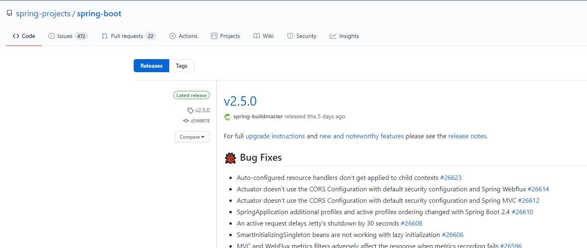
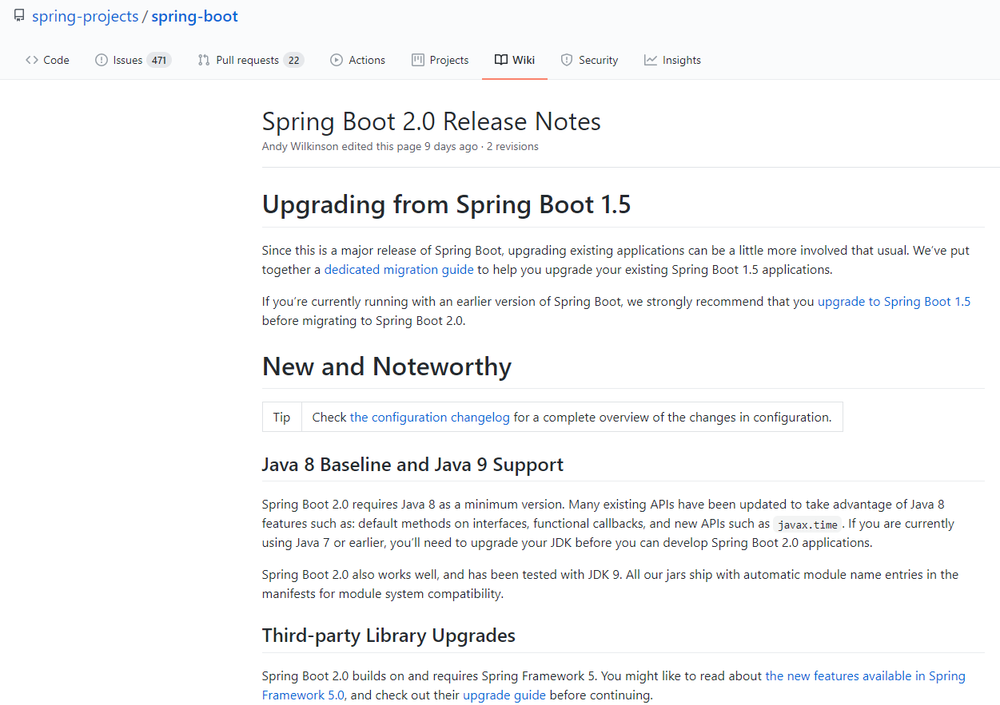
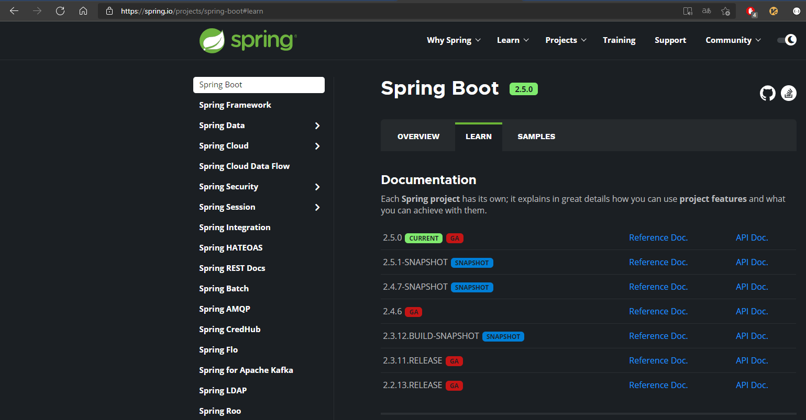
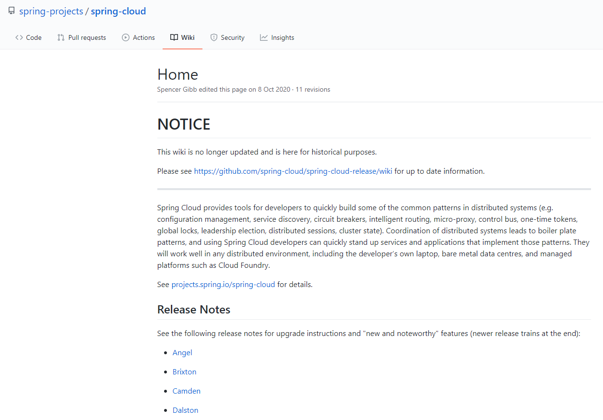
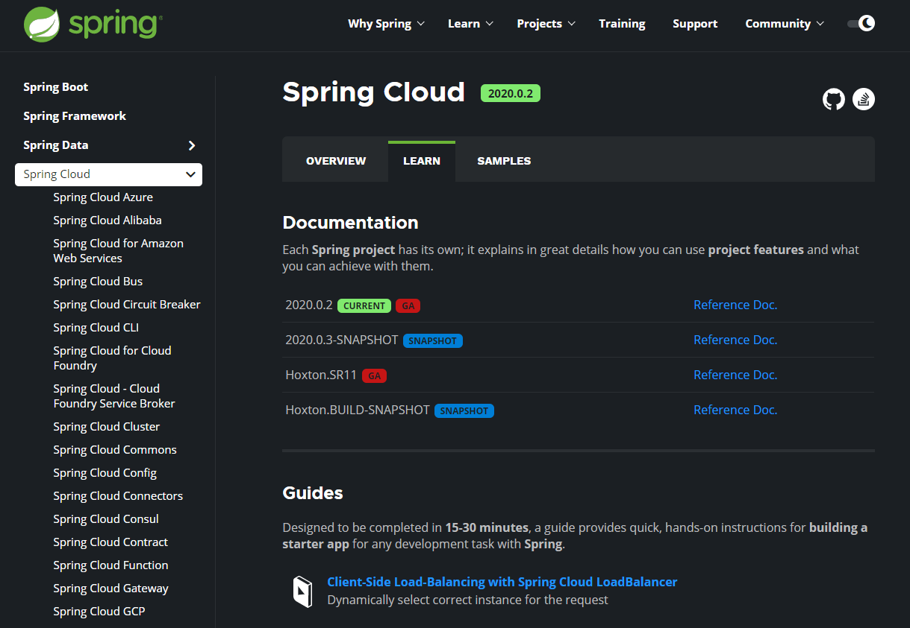
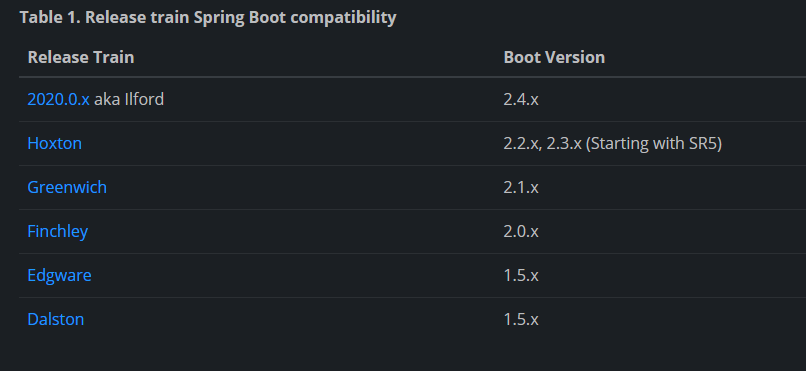

[TOC]

#  一、组件版本选择

## 1. SpringBoot版本选择

> Github：https://github.com/spring-projects/spring-boot/releases/
>
> 

> SpringBoot2.0新特性
>
> Github： https://github.com/spring-projects/spring-boot/wiki/Spring-Boot-2.0-Release-Notes
>
> 

> 查看最新版本：[Spring Boot](https://spring.io/projects/spring-boot#learn)
>
> 

## 2. SpringCloud版本选择

> Github：https://github.com/spring-projects/spring-cloud/wiki
>
> 
>
> 

> 官网：https://spring.io/projects/spring-cloud 

**Spring Cloud版本命名规则**：

&emsp;&emsp;Spring Cloud采用了*英国伦敦地铁站* 的名称来命名，并且地铁站名称由字母A-Z以此类推的形式来发布迭代版本。

&emsp;&emsp;Spring Cloud是一个由多个子项目组成的综合项目，各子项目有不同的发布节奏。为了管理Spring Cloud与各子项目的版本依赖关系，发布了一个清单，其中包括了某个Spring Cloud版本对应的子项目版本。为了避免Spring Cloud版本号与子项目版本号混淆，<font color='red'>Spring Cloud版本采用了名称而非版本号的命名，这些版本的名字采用了伦敦地铁站的名字，根据字母表的顺序来对应版本时间的顺序。</font>例如Angel是第一个版本，Brixton是第二个版本。当Spring Cloud的发布内容积累到临界点或者一个重大Bug被解决后，会发布一个“service releases”版本，简称SRX版本，比如Greenwich.SR2就是Spring Cloud发布的Greenwich版本的第2个SRX版本。

## 3. Spring Cloud和Spring Boot版本的依赖关系

> GitHub：https://spring.io/projects/spring-cloud#overview
>
> 

> 详细版本对应信息：https://start.spring.io/actuator/info
>
> ```json
> {
>     "git": {
>         "branch": "834ceddf42bde6ef07f7e4f751f2fdf8ffa94e5c",
>         "commit": {
>             "id": "834cedd",
>             "time": "2021-05-26T06:22:11Z"
>         }
>     },
>     "build": {
>         "version": "0.0.1-SNAPSHOT",
>         "artifact": "start-site",
>         "versions": {
>             "spring-boot": "2.5.0",
>             "initializr": "0.11.0-SNAPSHOT"
>         },
>         "name": "start.spring.io website",
>         "time": "2021-05-26T06:23:20.003Z",
>         "group": "io.spring.start"
>     },
>     "bom-ranges": {
>         "azure": {
>             "2.2.4": "Spring Boot >=2.2.0.RELEASE and <2.3.0.M1",
>             "3.2.0": "Spring Boot >=2.3.0.M1 and <2.4.0-M1",
>             "3.5.0": "Spring Boot >=2.4.0.M1 and <2.5.0-M1"
>         },
>         "codecentric-spring-boot-admin": {
>             "2.2.4": "Spring Boot >=2.2.0.RELEASE and <2.3.0.M1",
>             "2.3.1": "Spring Boot >=2.3.0.M1 and <2.5.0-M1"
>         },
>         "solace-spring-boot": {
>             "1.0.0": "Spring Boot >=2.2.0.RELEASE and <2.3.0.M1",
>             "1.1.0": "Spring Boot >=2.3.0.M1 and <2.5.0-M1"
>         },
>         "solace-spring-cloud": {
>             "1.0.0": "Spring Boot >=2.2.0.RELEASE and <2.3.0.M1",
>             "1.1.1": "Spring Boot >=2.3.0.M1 and <2.4.0-M1",
>             "2.0.0": "Spring Boot >=2.4.0.M1 and <2.5.0-M1"
>         },
>         "spring-cloud": {
>             "Hoxton.SR11": "Spring Boot >=2.2.0.RELEASE and <2.3.12.BUILD-SNAPSHOT",
>             "Hoxton.BUILD-SNAPSHOT": "Spring Boot >=2.3.12.BUILD-SNAPSHOT and <2.4.0.M1",
>             "2020.0.0-M3": "Spring Boot >=2.4.0.M1 and <=2.4.0.M1",
>             "2020.0.0-M4": "Spring Boot >=2.4.0.M2 and <=2.4.0-M3",
>             "2020.0.0": "Spring Boot >=2.4.0.M4 and <=2.4.0",
>             "2020.0.2": "Spring Boot >=2.4.1 and <2.5.0-M1",
>             "2020.0.3-SNAPSHOT": "Spring Boot >=2.4.7-SNAPSHOT"
>         },
>         "spring-cloud-alibaba": {
>             "2.2.1.RELEASE": "Spring Boot >=2.2.0.RELEASE and <2.3.0.M1"
>         },
>         "spring-cloud-gcp": {
>             "2.0.0": "Spring Boot >=2.4.0-M1 and <2.5.0-M1"
>         },
>         "spring-cloud-services": {
>             "2.2.6.RELEASE": "Spring Boot >=2.2.0.RELEASE and <2.3.0.RELEASE",
>             "2.3.0.RELEASE": "Spring Boot >=2.3.0.RELEASE and <2.4.0-M1",
>             "2.4.1": "Spring Boot >=2.4.0-M1 and <2.5.0-M1"
>         },
>         "spring-geode": {
>             "1.2.12.RELEASE": "Spring Boot >=2.2.0.RELEASE and <2.3.0.M1",
>             "1.3.11.RELEASE": "Spring Boot >=2.3.0.M1 and <2.4.0-M1",
>             "1.4.6": "Spring Boot >=2.4.0-M1 and <2.5.0-M1",
>             "1.5.0": "Spring Boot >=2.5.0-M1"
>         },
>         "vaadin": {
>             "14.6.1": "Spring Boot >=2.1.0.RELEASE and <2.5.0-M1"
>         },
>         "wavefront": {
>             "2.0.2": "Spring Boot >=2.1.0.RELEASE and <2.4.0-M1",
>             "2.1.1": "Spring Boot >=2.4.0-M1 and <2.5.0-M1",
>             "2.2.0-RC1": "Spring Boot >=2.5.0-M1"
>         }
>     },
>     "dependency-ranges": {
>         "native": {
>             "0.9.0": "Spring Boot >=2.4.3 and <2.4.4",
>             "0.9.1": "Spring Boot >=2.4.4 and <2.4.5",
>             "0.9.2": "Spring Boot >=2.4.5 and <2.5.0-M1",
>             "0.10.0-SNAPSHOT": "Spring Boot >=2.5.0-M1 and <2.6.0-M1"
>         },
>         "okta": {
>             "1.4.0": "Spring Boot >=2.2.0.RELEASE and <2.4.0-M1",
>             "1.5.1": "Spring Boot >=2.4.0-M1 and <2.4.1",
>             "2.0.1": "Spring Boot >=2.4.1 and <2.5.0-M1"
>         },
>         "mybatis": {
>             "2.1.4": "Spring Boot >=2.1.0.RELEASE and <2.5.0-M1"
>         },
>         "camel": {
>             "3.3.0": "Spring Boot >=2.2.0.RELEASE and <2.3.0.M1",
>             "3.5.0": "Spring Boot >=2.3.0.M1 and <2.4.0-M1",
>             "3.10.0": "Spring Boot >=2.4.0.M1 and <2.5.0-M1"
>         },
>         "open-service-broker": {
>             "3.1.1.RELEASE": "Spring Boot >=2.2.0.RELEASE and <2.3.0.M1",
>             "3.2.0": "Spring Boot >=2.3.0.M1 and <2.4.0-M1",
>             "3.3.0": "Spring Boot >=2.4.0-M1 and <2.5.0-M1"
>         }
>     }
> }
> ```
>
> 

