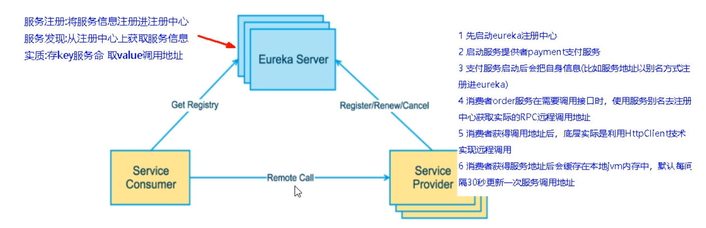
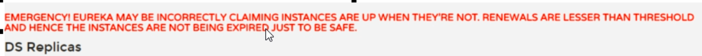

[TOC]

# 三、Eureka服务注册与发现

## 1. 微服务基础

+ **什么是服务治理**

  > Spring Cloud 封装了 Netflix 公司开发的 Eureka 模块来实现服务治理。
  >
  > 在传统的 rpc 远程调用框架中，管理每个服务与服务之间依赖关系比较复杂，所以需要服务治理，管理服务之间的依赖关系，可以实现服务调用、负载均衡、容错等，实现服务发现与注册。

+ **什么是服务注册**

  > &emsp;Eureka 采用了CS的设计架构，Eureka Server作为服务注册功能的服务器，它是服务注册中心。而系统中的其它微服务，使用Eureka的客户端连接到Eureka Server并且维持心跳连接。这样系统的维护人员就可以通过Eureka Server来监控系统中各个微服务是否正常运行。
  >
  > &emsp;在服务注册与发现中，有一个注册中心。当服务器启动的时候，会把当前自己服务器的信息，比如 服务地址通讯地址等以别名方式注册到注册中心上，另一方（消费者|服务提供者），以该别名的方式去注册中心上获取到实际的服务通讯地址，然后再实现本地RPC调用。
  >
  > &emsp;RPC远程调用框架核心设计思想：在于注册中心，因为使用注册中心管理每个服务于服务之间的一个依赖关系（服务治理概念）。在任何RPC远程框架中，都会有一个注册中心（存放服务地址相关信息（接口地址））。
  >
  > 

+ **Eureka两组件**

  > Eureka包含两个组件：**Eureka Server** 和 **Eureka Client**。
  >
  > **Eureka Server** 提供服务注册服务：
  >
  > &emsp;各个微服务节点通过配置启动后，会在EurekaServer中进行注册，这样EurekaServer中的服务注册表中将会存储所有可用服务节点的信息，服务节点的信息可以在界面中直观看到。
  >
  > **Eureka Client** 提供注册中心进行访问：
  >
  > &emsp;是一个Java客户端，用于简化Eureka Server的交互，客户端同时也具备一个内置的、使用轮训（round-robin）负载算法的负载均衡器。在应用启动后，将会向Eureka Server发送心跳（默认周期为30秒）。如果Eureka Server在多个心跳周期内没有接收到某个节点的心跳，Eureka Server将会从服务注册表中把这个服务节点移除（默认90秒）。

## 2. Eureka构建

> 1.X和2.X的对比说明：
>
> ```xml
> 老版本：
> <dependency>
> 	<groupId>org.springframework.cloud</groupId>
>     <artifactId>spring-cloud-starter-eureka</artifactId>
> </dependency>
> 新版本：
> <dependency>
> 	<groupId>org.springframework.cloud</groupId>
>     <artifactId>spring-cloud-starter-netflix-eureka-server</artifactId>
> </dependency>
> <dependency>
> 	<groupId>org.springframework.cloud</groupId>
>     <artifactId>spring-cloud-starter-netflix-eureka-client</artifactId>
> </dependency>
> ```

### 2.1 集群原理



**<font color="red">微服务RPC远程调用最核心的是什么：</font>**高可用。

### 2.2 配置文件

```yaml
server:
	port: 7001
	
eureka:
	instance:
		hostname: localhost	#eureka服务端的实例名称
	client:
		# false表示不向注册中心注册自己
		register-with-eureka: false
		# false表示自己端就是注册中心，我的职责就是维护服务实例，并不需要去检索服务
		fetch-registry: false
		service-url:
			defaultZone: http://${eureka.instance.hostname}:${server.port}/eureka/
```

### 2.3 负载均衡

+ consumer使用RestTemplate向provider发送请求时，URL应指定为http://SERVICE_NAME。
+ 使用**@LoadBalanced**注解赋予RestTemplate负载均衡的能力。
+ Ribbon和Eureka整合后Consumer可以直接调用服务而不用再关心地址和端口号，且该服务还有负载功能了。

## 3. Actuator 微服务信息完善

### 3.1 主机名称：服务名称修改

修改yaml文件：

```yaml
instance:
	instance-id: serviceName
```

### 3.2 访问信息有ip提示

修改yaml文件：

```yaml
instance:
	instance-id: serviceName
	prefer-ip-address: true
```

## 4. 服务发现Discovery

> 对于注册进eureka里面的微服务，可以通过服务发现来获得该服务的信息。

+ 修改provider的Controller：

  ```java
  @Resource
  private DiscoveryClient discoveryClient;
  
  @GetMapping(value = "/serverName/discovery")
  public Object discovery() {
      List<String> services = discoveryClient.getServices();
      for (String element : services) {
          log.info("***** element:"+element);
      }
      List<ServiceInstance> instances = discoveryClient.getInstances("CLOUD-PAYMENT-SERVICE");
      for (ServiceInstance instance : instances) {
          log.info(instance.getServiceId()+"\t"+instance.getHost()+"\t"+instance.getPort()+"\t"+instance.getUri());
      }
      return this.discoveryClient;
  }
  ```

  

+ 修改主启动类：

  ```java
  @EnableDiscoveryClient
  ```

  

+ 测试：http://ip:port/serverName/discovery。

## 5. Eureka自我保护

### 5.1 什么是Eureka保护模式

> &emsp;保护模式主要用于一组客户端和Eureka Server之间存在网络分区场景下的保护。
>
> **一旦进入保护模式，Eureka Server将会尝试保护其服务注册表中的信息，不再删除服务注册表中的数据，也就是不会注销任何微服务。**
>
> 如果在Eureka Server首页看到以下这段提示，则说明Eureka进入了保护模式：
>
> 

