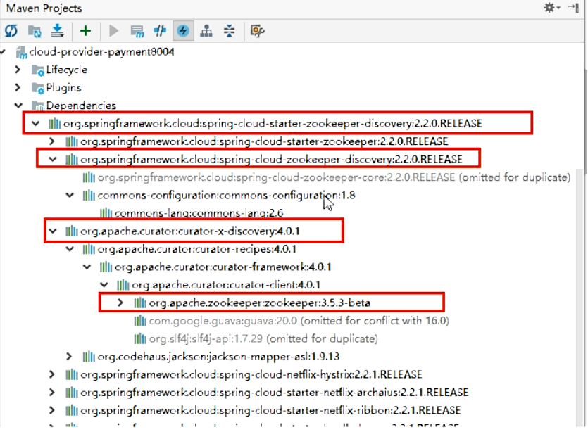

[TOC]

# 四、Zookeeper服务注册与发现

## 1. 注册中心Zookeeper

+ Zookeeper是一个分布式协调工具，可以实现注册中心功能。
+ 关闭linux服务器防火墙后启动zookeeper服务器。
+ zookeeper服务器取代eureka服务器，zk作为服务注册中心。

## 2. Zookeeper安装

> [下载地址 (hust.edu.cn)](http://mirrors.hust.edu.cn/apache/zookeeper/zookeeper-3.6.2/)
>
> 建议下载*apache-zookeeper-X.X.X-bin.tar.gz*，无需编译，*apache-zookeeper-X.X.X-bin.tar.gz*需要自行编译。

1. 解压

2. 修改配置文件（复制一份*zoo_simple.cfg*为*zoo.cfg*即可）

   ```properties
   # The number of milliseconds of each tick
   # tickTime：CS通信心跳数
   # Zookeeper 服务器之间或客户端与服务器之间维持心跳的时间间隔，也就是每个 tickTime 时间就会发送一个心跳。tickTime以毫秒为单位。
   tickTime=2000
   
   # The number of ticks that the initial
   # synchronization phase can take
   # initLimit：LF初始通信时限
   # 集群中的follower服务器(F)与leader服务器(L)之间初始连接时能容忍的最多心跳数（tickTime的数量）。
   initLimit=5
   
   # The number of ticks that can pass between
   # sending a request and getting an acknowledgement
   # syncLimit：LF同步通信时限
   # 集群中的follower服务器与leader服务器之间请求和应答之间能容忍的最多心跳数（tickTime的数量）。
   syncLimit=2
   
   # the directory where the snapshot is stored.
   # do not use /tmp for storage, /tmp here is just
   # example sakes.
   # dataDir：数据文件目录
   # Zookeeper保存数据的目录，默认情况下，Zookeeper将写数据的日志文件也保存在这个目录里。
   dataDir=/data/soft/zookeeper-3.4.12/data
   
   
   # dataLogDir：日志文件目录
   # Zookeeper保存日志文件的目录。
   dataLogDir=/data/soft/zookeeper-3.4.12/logs
   
   # the port at which the clients will connect
   # clientPort：客户端连接端口
   # 客户端连接 Zookeeper 服务器的端口，Zookeeper 会监听这个端口，接受客户端的访问请求。
   clientPort=2181
   
   # the maximum number of client connections.
   # increase this if you need to handle more clients
   #maxClientCnxns=60
   #
   # Be sure to read the maintenance section of the
   # administrator guide before turning on autopurge.
   #
   # http://zookeeper.apache.org/doc/current/zookeeperAdmin.html#sc_maintenance
   #
   # The number of snapshots to retain in dataDir 保留数量3
   autopurge.snapRetainCount=3
   # Purge task interval in hours
   # Set to "0" to disable auto purge feature 清理时间间隔1小时
   autopurge.purgeInterval=1
   
   
   # 服务器名称与地址：集群信息（服务器编号，服务器地址，LF通信端口，选举端口）
   # 这个配置项的书写格式比较特殊，规则如下：
   
   # server.N=YYY:A:B
   
   # 其中N表示服务器编号，YYY表示服务器的IP地址，A为LF通信端口，表示该服务器与集群中的leader交换的信息的端口。B为选举端口，表示选举新leader时服务器间相互通信的端口（当leader挂掉时，其余服务器会相互通信，选择出新的leader）。一般来说，集群中每个服务器的A端口都是一样，每个服务器的B端口也是一样。但是当所采用的为伪集群时，IP地址都一样，只能时A端口和B端口不一样。

3. 操作指令

   ```shell
   ./bin/zkServer.sh start
   ./bin/zkServer.sh status
   ./bin/zkServer.sh stop
   
   ./bin/zkCli.sh -server 127.0.0.1:2181
   ```

## 3. Zookeeper使用

1. 依赖

   ```xml
   <!-- https://mvnrepository.com/artifact/org.springframework.cloud/spring-cloud-starter-zookeeper-discovery -->
   <dependency>
       <groupId>org.springframework.cloud</groupId>
       <artifactId>spring-cloud-starter-zookeeper-discovery</artifactId>
   </dependency>
   ```

2. 配置文件

    ```yaml
    spring:
      application:
        name: cloud-provider-payment
      cloud:
        zookeeper:
          connect-string: 127.0.0.1:2181
    ```

3. 主启动类

    ```java
    import org.springframework.cloud.client.discovery.EnableDiscoveryClient;
    
    @EnableDiscoveryClient
    ```

    

4. 可能出现的问题

    + 启动不成功，jar包依赖的问题，可通过maven进行排查。

	

    通过修改pom：

    ```xml
    <!-- https://mvnrepository.com/artifact/org.springframework.cloud/spring-cloud-starter-zookeeper-discovery -->
    <dependency>
        <groupId>org.springframework.cloud</groupId>
        <artifactId>spring-cloud-starter-zookeeper-discovery</artifactId>
        <!--排除zk3.5.3-->
        <exclusions>
            <exclusion>
                <groupId>org.apache.zookeeper</groupId>
                <artifactId>zookeeper</artifactId>
            </exclusion>
        </exclusions>
    </dependency>
    <!--添加zk 3.4.9版本-->
    <!-- https://mvnrepository.com/artifact/org.apache.zookeeper/zookeeper -->
    <dependency>
        <groupId>org.apache.zookeeper</groupId>
        <artifactId>zookeeper</artifactId>
        <version>3.4.9</version>
    </dependency>
    
    ```

5. 查看注册的微服务

   ```shell
   ./bin/zkCli.sh -server ip:port
   
   [zk: localhost:2181(CONNECTED) 0] ls /services
   [cloud-consumerzk-order, cloud-provide-payment]
   [zk: localhost:2181(CONNECTED) 1] ls /services/cloud-provide-payment
   [86b6aa85-71a7-4f1c-b803-2b7c35c901b8]
   [zk: localhost:2181(CONNECTED) 2] get /services/cloud-provide-payment/86b6aa85-71a7-4f1c-b803-2b7c35c901b8
   {"name":"cloud-provide-payment","id":"86b6aa85-71a7-4f1c-b803-2b7c35c901b8","address":"Corwin-PC","port":8004,"sslPort":null,"payload":{"@class":"org.springframework.cloud.zookeeper.discovery.ZookeeperInstance","id":"application-1","name":"cloud-provide-payment","metadata":{}},"registrationTimeUTC":1623566201861,"serviceType":"DYNAMIC","uriSpec":{"parts":[{"value":"scheme","variable":true},{"value":"://","variable":false},{"value":"address","variable":true},{"value":":","variable":false},{"value":"port","variable":true}]}}
   ```

## 4. 服务节点是临时节点还是持久节点？

> 是临时节点。

通过实验可知，节点服务关闭，zookeeper很快就会将服务移除。

